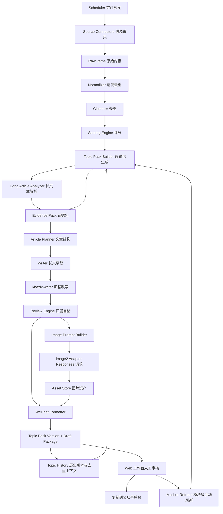

# AI 论文与行业热点公众号内容雷达架构设计

## 1. 架构目标

本系统是一个个人使用的 AI 论文与行业热点内容生产工作台。它每天 11:00 自动采集 AI 论文、行业信号、开源项目和热点资讯，生成一套版本化 topic pack：5 个论文深度解读候选、5-10 个 AI 热点话题、5-10 篇高热 arXiv 论文，并生成可审核、可排版、可复制到公众号后台的稿件包。

系统不做公众号自动发布。最终发布动作由人工完成。

### 1.1 MVP 目标

- 每天 11:00 稳定生成 1 套 topic pack。
- 每个 topic pack 固定包含 5 个论文深度解读候选、5-10 个 AI 热点话题、5-10 篇高热 arXiv 论文。
- 长文章候选必须绑定具体 AI 论文或论文组，不能由 GitHub 项目、新闻或泛话题单独充当。
- 长文章需要调用 LLM 做详细解读和降 AI 味改写，并使用配置好的 image API 生成封面图和机制图；image API 未配置或失败时，长文章生成失败并暴露错误。
- AI 热点和 arXiv 论文只生成简要概述，不展开成长文。
- 每次自动生成和手动刷新都保存 topic pack 版本，支持按日期查看历史话题。
- 手动刷新支持按模块刷新：长文章、AI 热点、arXiv 论文或全部刷新。
- 手动刷新必须调用 LLM 生成新角度，并读取历史记录做去重。
- 每篇稿件保留来源、证据链、审核清单和可复制排版稿。
- 允许人工对选题、标题、正文、图片和排版进行重跑。

### 1.2 非目标

- MVP 不做自动发布公众号。
- MVP 不做多人协作和权限系统。
- MVP 不做复杂自媒体平台爬虫。
- MVP 不做完整增长数据闭环。
- Docker 部署文件最后再补，不作为本阶段架构文档的交付重点。

## 2. 产品定位

每日 topic pack 结构固定为：

```text
论文深度解读候选：5 个，可详细解读
AI 热点话题：5-10 个，简要概述
arXiv 高热论文：5-10 篇，简要概述
```

头版文章只从论文深度解读候选中选择，优先选择近期学术价值高、值得公众号深度解读的 AI 论文。这里的“近期高热”不死卡 24 小时或 7 天，而是指近期在研究价值、方法贡献、实验扎实度或社区讨论中明显值得读。重点输出：

- 论文解决的问题。
- 方法贡献和技术新意。
- 实验可信度。
- 局限和风险。
- 为什么现在值得读。
- 如果有代码或复现材料，作为辅助证据说明。

AI 热点模块用于补充当天 AI 圈动态，承载模型发布、工具更新、GitHub 项目、行业新闻和一句判断。

arXiv 模块用于筛选近期值得关注的 AI 论文，帮助读者快速判断哪些论文值得加入阅读列表或后续展开成长论文解读。排序以学术价值优先，GitHub 和社区热度只作为辅助信号。

## 3. 总体架构



## 4. 推荐技术栈

| 层级 | 技术 | 说明 |
| --- | --- | --- |
| Frontend | Next.js + React | 个人工作台、审核、预览、重跑 |
| Styling | Tailwind CSS | 快速构建高质感深色工作台 |
| Motion | Motion for React | 今日雷达、卡片进入、任务状态动效 |
| Backend API | FastAPI | 结构清晰，适合任务型 API |
| Worker | Celery 或 RQ | 采集、解析、生成、图片、排版异步执行 |
| Queue | Redis | 任务队列和短期状态 |
| Database | PostgreSQL | 结构化内容、任务、稿件状态 |
| Vector | pgvector | 相似论文、历史选题、去重和召回 |
| Storage | 本地文件目录起步 | 保存 Markdown、HTML、图片、来源文件 |
| Scheduler | Celery Beat 或 APScheduler | 每日自动采集与生成 |
| LLM | OpenAI-compatible Responses | 文章规划、证据总结、审核 |
| Image | image2 中转站 + Responses 请求 | 封面图、机制图、后续金句图 |
| Layout | Markdown -> WeChat HTML | 公众号可复制排版稿 |

MVP 建议优先选择 `FastAPI + PostgreSQL + Redis + Worker + Next.js`。n8n 可以后续作为可视化编排补充，不建议作为核心业务逻辑承载层。

## 5. 代码仓库结构

建议使用单仓库：

```text
apps/
  api/                         FastAPI 服务
  web/                         Next.js 工作台
workers/
  ingest/                      信源采集任务
  analyze/                     论文解析、聚类、评分任务
  generate/                    文章、图片、排版生成任务
packages/
  connectors/                  RSS、arXiv、GitHub、Semantic Scholar 等连接器
  prompts/                     写作、评分、图片、审核 prompt
  scoring/                     评分规则
  wechat/                      Markdown 到公众号 HTML 转换
  image2/                      image2 Responses 适配器
  evidence/                    证据包构建与 claim 约束
  shared/                      通用 schema、错误类型、工具函数
storage/
  drafts/                      稿件包输出目录
  assets/                      图片和附件
docs/
  architecture/                架构补充文档
```

## 6. 核心服务边界

### 6.1 API 服务

职责：

- 提供工作台所需 REST API。
- 查询今日雷达、当前 topic pack、历史 topic pack、论文解析、稿件包。
- 触发人工重跑任务和模块级手动刷新。
- 返回任务状态。
- 管理来源配置和健康状态。

不负责：

- 长耗时采集。
- LLM 生成。
- 图片生成。
- 大批量排版转换。

### 6.2 Worker 服务

按任务类型拆分逻辑模块，进程可以先共用一个 worker，后续再按队列拆开。

任务类型：

- `ingest.fetch_source`
- `ingest.normalize_item`
- `analyze.cluster_signals`
- `analyze.score_topics`
- `generate.build_topic_pack`
- `generate.refresh_topic_pack_module`
- `analyze.build_paper_profile`
- `generate.build_evidence_pack`
- `generate.plan_article`
- `generate.write_article`
- `generate.rewrite_khazix_style`
- `generate.review_article`
- `generate.create_image_prompts`
- `generate.generate_image2_asset`
- `generate.render_wechat_html`
- `generate.package_draft`

### 6.3 Frontend 工作台

MVP 保留 4 个核心页面：

1. 今日雷达
2. 选题池
3. 文章工坊
4. 历史话题

论文解析台在 MVP 中作为选题详情的一部分出现。素材资产库在 MVP 中先以稿件历史、topic pack 历史和来源搜索承接，不单独做复杂页面。

## 7. 数据流

### 7.1 每日自动任务

```text
11:00 run-scheduled
11:00 check_sources：抓取 arXiv / RSS / GitHub Search / 官方博客并校验健康状态
11:02 run_daily --live-sources：只在 source gate 全部健康后写入今日 run
11:05 清洗、去重、评分，生成 5-10 个真实信源选题
11:10 调用 LLM 生成 topic pack，并校验 5 / 5-10 / 5-10 三个模块数量
11:15 用户从 topic pack 或选题池选择长文章后生成详细解读和证据包
11:20 调用 image2 生成封面图和机制图
11:25 输出 Markdown、HTML、来源、审核清单和图片资产
11:30 保存 topic pack version、draft version 和稿件包
```

时间可以配置。任一启用信源或 provider 失败都会让当前命令非零退出；系统必须暴露错误、保留上一轮成功数据，并允许修复后重试同一阶段。

### 7.2 模块级手动刷新流

```text
用户选择刷新模块：long_articles / ai_hotspots / arxiv_papers / all
读取当前 topic pack version
读取当天历史版本、已发布话题、已拒绝话题和相似角度
构建 LLM 去重上下文
调用 LLM 生成指定模块的新内容
校验数量、来源和去重结果
未刷新模块从上一版复制
创建新的 topic pack version
前端重新拉取当前 topic pack 和稿件包
```

约束：

- 手动刷新必须调用 LLM，不允许只在固定 seed 选题里切换。
- 刷新失败不覆盖上一版成功结果。
- 每次刷新都记录 trigger、module、prompt 摘要、response id 和生成结果。

### 7.3 人工审核流

```text
打开今日稿件包
查看 topic pack 三个模块和评分依据
查看头版文章证据包
编辑标题、摘要、正文
按需刷新长文章 / AI 热点 / arXiv 论文模块
按需重跑标题/正文/图片/排版
查看审核清单
复制 HTML 或 Markdown 到公众号后台
标记已发布或已废弃
```

## 8. 数据模型

### 8.1 sources

信源配置和健康状态。

| 字段 | 类型 | 说明 |
| --- | --- | --- |
| id | uuid | 主键 |
| name | text | 信源名称 |
| type | enum | rss, api, github, arxiv, manual |
| url | text | 地址 |
| enabled | boolean | 是否启用 |
| fetch_interval_minutes | int | 抓取间隔 |
| last_success_at | timestamptz | 最近成功时间 |
| last_error | text | 最近错误 |
| created_at | timestamptz | 创建时间 |

### 8.2 raw_items

原始抓取内容，不做强加工。

| 字段 | 类型 | 说明 |
| --- | --- | --- |
| id | uuid | 主键 |
| source_id | uuid | 信源 |
| external_id | text | 外部 ID |
| url | text | 原文链接 |
| title | text | 原始标题 |
| content | text | 原始正文或摘要 |
| author | text | 作者 |
| published_at | timestamptz | 发布时间 |
| raw_json | jsonb | 原始响应 |
| content_hash | text | 去重 hash |
| created_at | timestamptz | 抓取时间 |

### 8.3 signals

清洗后的新闻、论文、项目、产品发布。

| 字段 | 类型 | 说明 |
| --- | --- | --- |
| id | uuid | 主键 |
| raw_item_id | uuid | 来源 raw item |
| kind | enum | news, paper, repo, product, post |
| title | text | 标准标题 |
| summary | text | 摘要 |
| url | text | 主链接 |
| entities | jsonb | 公司、模型、论文、作者、项目 |
| tags | text[] | 标签 |
| published_at | timestamptz | 发布时间 |
| embedding | vector | 语义向量 |
| created_at | timestamptz | 创建时间 |

### 8.4 clusters

把多个相似信号聚成事件或方向。

| 字段 | 类型 | 说明 |
| --- | --- | --- |
| id | uuid | 主键 |
| title | text | 聚类标题 |
| summary | text | 聚类摘要 |
| kind | enum | paper_topic, industry_event, repo_trend |
| signal_ids | uuid[] | 包含信号 |
| heat_score | numeric | 热度 |
| first_seen_at | timestamptz | 首次出现 |
| last_seen_at | timestamptz | 最近出现 |

### 8.5 papers

论文结构化档案。

| 字段 | 类型 | 说明 |
| --- | --- | --- |
| id | uuid | 主键 |
| arxiv_id | text | arXiv ID |
| title | text | 标题 |
| authors | text[] | 作者 |
| abstract | text | 摘要 |
| pdf_url | text | PDF |
| code_url | text | 代码 |
| published_at | timestamptz | 发布时间 |
| categories | text[] | arXiv 分类 |
| method_summary | text | 方法摘要 |
| experiment_summary | text | 实验摘要 |
| limitations | text | 局限 |
| replication_value | numeric | 复现价值 |
| extension_topics | jsonb | 可延伸选题 |

### 8.6 topics

标准化后的单个选题或条目。长文章、AI 热点和 arXiv 论文都可以落到 topics，但必须通过 `topic_pack_items` 绑定到某个版本。

| 字段 | 类型 | 说明 |
| --- | --- | --- |
| id | uuid | 主键 |
| cluster_id | uuid | 关联聚类 |
| paper_id | uuid | 如果是论文选题则关联论文 |
| title | text | 选题标题 |
| angle | text | 写作角度 |
| article_type | enum | long_paper, industry_analysis, topic_inspiration, short_hotspot |
| status | enum | candidate, selected, drafted, published, rejected |
| score_total | numeric | 总分 |
| score_detail | jsonb | 四项评分和解释 |
| business_hook | text | 解读价值点 |
| dedupe_key | text | 标题、URL、arXiv ID、实体和角度组合出的去重 key |
| angle_hash | text | 写作角度语义 hash |
| created_at | timestamptz | 创建时间 |

### 8.7 topic_pack_versions

每日选题包版本表。每次 11:00 自动生成或手动刷新都创建一条记录。

| 字段 | 类型 | 说明 |
| --- | --- | --- |
| id | uuid | 主键 |
| date | date | 所属日期 |
| version | int | 当天版本号，从 1 递增 |
| trigger | enum | scheduled, manual |
| refreshed_module | enum | all, long_articles, ai_hotspots, arxiv_papers |
| status | enum | generating, ready, failed |
| llm_prompt_summary | text | prompt 摘要，不保存敏感 key |
| llm_response_id | text | LLM response id |
| previous_version_id | uuid | 手动刷新时指向上一版 |
| created_at | timestamptz | 创建时间 |

### 8.8 topic_pack_items

topic pack 中的模块条目。

| 字段 | 类型 | 说明 |
| --- | --- | --- |
| id | uuid | 主键 |
| pack_version_id | uuid | 所属 topic pack version |
| topic_id | uuid | 标准化 topic |
| module | enum | long_articles, ai_hotspots, arxiv_papers |
| rank | int | 模块内排序 |
| title | text | 展示标题 |
| summary | text | 简要概述 |
| angle | text | 长文章角度或简要判断 |
| source_urls | text[] | 来源链接 |
| arxiv_id | text | arXiv 论文条目可选 |
| status | enum | candidate, selected, drafted, published, rejected |
| llm_response_id | text | 生成该条目的 response id |
| dedupe_key | text | 去重 key |
| angle_hash | text | 角度 hash |

数量约束：

- `long_articles`: 5 条。
- `ai_hotspots`: 5-10 条。
- `arxiv_papers`: 5-10 条。

### 8.9 evidence_items

证据链条，约束文章生成。

| 字段 | 类型 | 说明 |
| --- | --- | --- |
| id | uuid | 主键 |
| topic_id | uuid | 选题 |
| source_url | text | 来源 |
| source_title | text | 来源标题 |
| claim | text | 可支撑的事实点 |
| snippet | text | 证据摘录或摘要 |
| confidence | enum | high, medium, low |
| risk_note | text | 风险说明 |
| created_at | timestamptz | 创建时间 |

### 8.10 drafts

稿件主表。

| 字段 | 类型 | 说明 |
| --- | --- | --- |
| id | uuid | 主键 |
| topic_id | uuid | 选题 |
| pack_version_id | uuid | 来源 topic pack version |
| module | enum | long_articles, ai_hotspots, arxiv_papers |
| title | text | 当前标题 |
| subtitle | text | 副标题 |
| status | enum | generating, review, ready, published, rejected |
| markdown_path | text | Markdown 路径 |
| html_path | text | 微信 HTML 路径 |
| sources_path | text | 来源清单 |
| checklist_path | text | 审核清单 |
| version | int | 版本 |
| created_at | timestamptz | 创建时间 |
| updated_at | timestamptz | 更新时间 |

### 8.11 draft_assets

图片和附件。

| 字段 | 类型 | 说明 |
| --- | --- | --- |
| id | uuid | 主键 |
| draft_id | uuid | 稿件 |
| kind | enum | cover, mechanism, quote, source_file |
| prompt | text | 图片 prompt |
| revised_prompt | text | Responses 返回的 revised prompt |
| path | text | 本地或对象存储路径 |
| width | int | 宽度 |
| height | int | 高度 |
| provider | text | image2 |
| provider_request_id | text | 中转站请求 ID |
| created_at | timestamptz | 创建时间 |

### 8.12 jobs

后台任务状态。

| 字段 | 类型 | 说明 |
| --- | --- | --- |
| id | uuid | 主键 |
| type | text | 任务类型 |
| status | enum | queued, running, succeeded, failed, canceled |
| input | jsonb | 输入 |
| output | jsonb | 输出摘要 |
| error | text | 错误 |
| retry_count | int | 重试次数 |
| started_at | timestamptz | 开始时间 |
| finished_at | timestamptz | 结束时间 |

## 9. 评分设计

总分不只用于排序，还必须给出解释，让人工能快速判断系统为什么推荐。

### 9.1 Heat

衡量当前热度。

因子：

- 24 小时内出现次数。
- 多源交叉出现数量。
- GitHub star / fork / issue 增速。
- HN、Product Hunt、官方博客等外部信号。
- 发布时间新鲜度。

### 9.2 Relevance

衡量论文或信号的 AI 研究价值。

因子：

- 是否有明确研究问题。
- 是否有可解释方法。
- 是否有扎实实验、对比基线或清楚的评测设置。
- 是否可能影响近期 AI 研究讨论。
- 是否关联 LLM、多模态、生成模型、AI safety、推理效率、训练方法、评测、AI coding、AI4Science、机器人、世界模型等 AI 方向。

### 9.3 Writeability

衡量是否适合写成长文。

因子：

- 是否有冲突、变化或明确问题意识。
- 是否有足够来源支撑。
- 是否能拆成“问题-方法-实验-局限-启发”。
- 是否有配图空间。

### 9.4 Academic Value

衡量是否值得进一步做深度解读。

因子：

- 论文贡献是否足够清楚。
- 实验可信度是否足够讨论。
- 是否能帮助读者理解一个研究趋势、方法分歧或技术瓶颈。
- 是否有足够来源支撑，避免只凭标题写判断。

## 10. 文章生成链路

### 10.1 Evidence-first

文章生成必须先构建证据包。LLM 写作阶段只能引用证据包中的事实点，不能自由扩写未经证据支撑的事实。

证据包包括：

```text
topic.md                 选题信息
paper-profile.md         论文档案
evidence.json            结构化证据
sources.md               来源清单
risk-notes.md            风险和不确定点
```

### 10.2 Topic Pack LLM 生成

topic pack 生成必须调用 LLM，并要求返回结构化 JSON。后端负责做 schema 校验、数量校验和去重校验。

输入上下文：

- 近期 signals、papers、repos、news。论文候选不死卡 24 小时，但必须保持近期相关性。
- 当天历史 topic pack versions。
- 历史已发布、已拒绝、已使用的话题。
- 已出现标题、URL、arXiv ID、实体和 angle hash。
- 模块目标数量。

输出结构：

```json
{
  "long_articles": [],
  "ai_hotspots": [],
  "arxiv_papers": []
}
```

校验规则：

- `long_articles` 必须 5 条，且每条必须绑定 arXiv ID、论文 URL 或论文组来源。
- `ai_hotspots` 必须 5-10 条。
- `arxiv_papers` 必须 5-10 条。
- GitHub repo、产品动态和行业新闻不能单独进入 `long_articles`，只能进入 `ai_hotspots` 或作为论文条目的辅助来源。
- 同一 topic pack 内不能重复标题、URL、arXiv ID 或高度相似角度。
- 手动刷新模块时，新模块不能重复当天历史版本已出现的同质条目。

### 10.3 长论文解析模板

头版文章建议结构：

```text
标题
导语：为什么这篇论文近期值得看
1. 这篇论文到底想解决什么问题
2. 它的方法贡献在哪里
3. 实验结果能不能信
4. 它和已有工作的区别是什么
5. 局限和风险在哪里
6. 如果有代码或复现材料，应该怎么看
7. 我的判断：为什么值得读，是否值得后续展开
AI 热点模块：简要概述
arXiv 论文模块：简要概述
来源清单
```

### 10.4 热点和 arXiv 简要概述模板

AI 热点和 arXiv 论文不展开成长文，只输出简要概述。

AI 热点条目：

```text
标题
来源
一句话摘要
一句判断
为什么值得关注
```

arXiv 论文条目：

```text
论文名
arXiv 链接
方向标签
核心贡献
实验亮点
适合谁读
是否值得后续展开成长文章
```

### 10.5 四层自检

每篇文章生成后必须通过：

1. 事实风险检查：每个关键事实能否追溯到来源。
2. AI 味检查：删除报告腔、空泛过渡、模板化表达。
3. 学术价值检查：主文章是否围绕论文贡献、实验和局限展开，避免泛泛趋势判断。
4. 公众号排版检查：标题层级、图片位置、引用和来源完整。

## 11. image2 中转站适配

图片生成通过 image2 中转站完成，但调用形态按 OpenAI Responses API 兼容设计。系统内部不要把 image2 写死在业务逻辑里，而是封装成 `ImageProvider`。

### 11.1 环境变量

```env
IMAGE_PROVIDER=image2
IMAGE2_BASE_URL=https://your-image2-relay.example.com/v1
IMAGE2_API_KEY=replace-me
IMAGE2_RESPONSES_MODEL=relay-image-model
IMAGE2_OUTPUT_FORMAT=png
IMAGE2_QUALITY=high
IMAGE2_SIZE=1536x1024
```

`IMAGE2_RESPONSES_MODEL` 是中转站暴露的图片模型名。具体值以中转站支持为准，不在业务代码中硬编码。

### 11.2 请求形态

中转站应兼容：

```http
POST /v1/responses
Authorization: Bearer ${IMAGE2_API_KEY}
Content-Type: application/json
```

请求体建议：

```json
{
  "model": "relay-image-model",
  "input": "Draw a premium WeChat cover image for an article about ...",
  "tools": [
    {
      "type": "image_generation",
      "size": "1536x1024",
      "quality": "high",
      "format": "png"
    }
  ],
  "tool_choice": {
    "type": "image_generation"
  }
}
```

返回解析规则：

```text
response.output
  -> 找到 type == "image_generation_call"
  -> 读取 result 字段中的 base64 图片
  -> 读取 revised_prompt 字段保存到 draft_assets.revised_prompt
  -> 解码保存为 cover.png 或 figures/*.png
```

### 11.3 图片类型

MVP 只生成：

- 封面图：`cover.png`
- 机制图：`figures/mechanism.png`

V1 再增加：

- 金句图。
- 多模板封面。
- 历史风格复用。

### 11.4 图片 prompt 原则

- 封面图表达主题，不做纯装饰科技背景。
- 机制图优先解释论文方法，不追求花哨。
- 避免廉价紫色渐变。
- 风格和前端一致：高级、鲜艳、有科技感，但主体清晰。
- 每个图片 prompt 都保存，方便重跑和复盘。

## 12. 前端信息架构

### 12.1 今日雷达

目标：早上打开即可知道今天有什么值得写。

模块：

- 今日信号总数。
- AI 强相关信号数。
- 来源健康状态。
- Top 5 热点。
- 论文 / 新闻 / GitHub / 产品发布分类。
- 今日 topic pack 摘要。
- 当前版本号、触发方式和生成时间。

### 12.2 选题池

目标：快速判断系统推荐是否靠谱，并可以按模块刷新。

页面分为三个模块：

- 长文章候选：5 个。
- AI 热点话题：5-10 个。
- arXiv 高热论文：5-10 篇。

每张卡展示：

- 标题。
- 推荐文章类型。
- Heat / Relevance / Writeability / Conversion。
- 一句话推荐理由。
- 解读价值角度。
- 来源数量。
- 证据风险。
- 操作：选为头版、生成草稿、忽略、稍后、标记已发布。

模块操作：

- 刷新长文章。
- 刷新 AI 热点。
- 刷新 arXiv 论文。
- 刷新全部。

### 12.3 历史话题

目标：回看每天生成过什么，避免后续重复选题。

页面能力：

- 按日期查看 topic pack。
- 展示同一天的版本列表。
- 展示每个版本的触发方式、刷新模块、生成时间。
- 展示该版本内三个模块的全部条目。
- 查看条目状态：candidate、selected、drafted、published、rejected。
- 支持从历史条目进入详情或稿件。

### 12.4 文章工坊

目标：在 10-20 分钟内完成审核和复制发布。

区域：

- 左侧：文章目录、来源、审核清单。
- 中间：Markdown 编辑器。
- 右侧：微信预览、图片、重跑按钮。

必须支持：

- 从当前 topic pack 选择长文章。
- 重跑标题。
- 重跑导语。
- 重跑整篇。
- 重跑 khazix 风格改写。
- 重跑封面图。
- 重跑机制图。
- 重新生成微信 HTML。

## 13. API 设计

MVP API：

```text
GET  /health
GET  /api/radar/today
GET  /api/sources
POST /api/sources/{id}/refresh

GET  /api/topic-packs?date=YYYY-MM-DD
GET  /api/topic-packs/current?date=YYYY-MM-DD
GET  /api/topic-packs/{id}
POST /api/topic-packs/refresh

GET  /api/topics?date=YYYY-MM-DD
GET  /api/topics/{id}
POST /api/topics/{id}/select
POST /api/topics/{id}/reject

GET  /api/papers/{id}
POST /api/papers/analyze

GET  /api/drafts?date=YYYY-MM-DD
GET  /api/drafts/{id}
PUT  /api/drafts/{id}/content
POST /api/drafts/{id}/regenerate
POST /api/drafts/{id}/render-wechat
POST /api/drafts/{id}/mark-published

GET  /api/jobs/{id}
POST /api/jobs/{id}/cancel
```

模块刷新请求：

```json
{
  "date": "2026-06-22",
  "module": "long_articles | ai_hotspots | arxiv_papers | all",
  "reason": "用户可选填写"
}
```

返回新的 `TopicPackVersion`，并保留上一版。

重跑接口建议统一：

```json
{
  "stage": "title | outline | article | style | review | cover | mechanism | wechat",
  "reason": "用户可选填写"
}
```

## 14. 稿件包格式

每篇文章输出：

```text
storage/topic-packs/YYYY-MM-DD/vNN/
  topic-pack.json
  prompt-summary.md
  dedupe-context.json

storage/drafts/YYYY-MM-DD/topic-slug/
  article.md
  article-wechat.html
  sources.md
  review-checklist.md
  evidence.json
  topic.md
  cover.png
  figures/
    mechanism.png
```

`sources.md` 必须可读，不只是 URL 列表：

```text
1. Paper: Title
   URL:
   Used for: 方法、实验、局限

2. GitHub Repository: Name
   URL:
   Used for: 代码与实验材料价值
```

`review-checklist.md` 必须包含：

```text
- [ ] 标题是否准确，不夸大
- [ ] 论文核心贡献是否有来源支撑
- [ ] 实验结论是否没有过度推断
- [ ] 解读价值是否自然
- [ ] 图片是否贴合内容
- [ ] HTML 复制到公众号后台是否正常
```

## 15. 错误处理和重试

### 15.1 信源失败

- 严格实时信源模式下，任一启用信源失败都会阻塞本次日报生成。
- 保存 `last_error`，并将失败源标记为 `failed`。
- 今日雷达展示来源健康状态。
- 不回退本地样例，不覆盖上一轮成功 run 或 topic pack。

### 15.2 LLM 失败

- 保存请求摘要和错误信息。
- 支持从当前阶段重跑。
- 不覆盖上一版成功稿件。
- 不覆盖上一版 topic pack。
- 每次成功生成都增加 draft version。

### 15.3 图片失败

- 图片生成必须调用 image2 provider。
- image2 未配置、超时或中转站失败时直接返回错误。
- 不生成本地占位图，不用占位图覆盖上一版成功图片或稿件。
- 用户可在修复配置或上游状态后单独重跑图片。

### 15.4 排版失败

- 保留 Markdown。
- 返回 HTML 转换错误。
- 支持单独重跑排版。

### 15.5 模块刷新失败

- 手动刷新某个模块失败时，当前 topic pack version 保持不变。
- 失败 job 保存模块名、原因、prompt 摘要和错误信息。
- 前端展示错误，并允许用户重试同一模块。
- 不允许用空模块或重复模块覆盖成功版本。

## 16. 安全和配置

- API Key 只放在服务端环境变量。
- 前端不暴露 OpenAI、image2、GitHub、Semantic Scholar Key。
- 所有外部请求设置超时。
- 所有抓取遵守公开 API、RSS 或公开页面的合理访问频率。
- 不保存不必要的个人隐私数据。
- MVP 单人使用可以先采用本地登录密码或反向代理 Basic Auth。

## 17. 部署策略

### 17.1 MVP 部署

MVP 推荐：

```text
单台 VPS 或本地 Mac mini
PostgreSQL
Redis
FastAPI
Worker
Next.js
本地文件存储
```

使用 Docker Compose 是最合适的部署方式，但 Docker 文件最后再补。

### 17.2 V1 部署增强

- 本地文件迁移到 S3 / Cloudflare R2。
- Postgres 开启定时备份。
- Worker 按队列拆分。
- 加入简单登录。
- 加入飞书文档同步出口。

### 17.3 飞书出口

根据当前项目约定，飞书相关能力优先走 lark。

V1 可以增加：

```text
POST /api/drafts/{id}/export/lark
```

导出内容：

- 文章正文。
- 来源清单。
- 审核清单。
- 图片链接或附件。

这不是 MVP 阻塞项，但适合后续做长期归档和移动端审稿。

## 18. 成熟编辑器体验与排版集成

### 18.1 目标

文章工坊要承担公众号发布前的最后一公里：使用者可以在同一页面编辑 Markdown、查看实时预览、保存稿件、重新生成微信 HTML、复制 Markdown 或 HTML，再进入微信后台人工发布。它不是自动发布器，也不是单纯的静态预览页。

### 18.2 许可证选择

排版编辑器候选以宽松许可证为优先：

| 候选 | 许可证 | 架构判断 |
| --- | --- | --- |
| doocs/md | WTFPL | 成熟编辑器体验标杆，可作为 UX 和后续渲染/主题兼容方向 |
| WeMD | MIT | 可作为轻量本地编辑器参考 |
| xiaohu-wechat-format | MIT | Python 后端可参考其转换/草稿链路 |
| md2wechat-skill | BUSL/Source Available | 不复制源码或主题；如个人手动使用，只作为外部 CLI 可选项 |

MVP 当前采用内置编辑器闭环，不引入第三方源码。后续如果接入 doocs/md 或 WeMD，应通过 `packages/wechat` 或后端 adapter 包装，保留原许可证声明，避免把第三方实现散落到业务代码里。

### 18.3 MVP 实现边界

当前 MVP 的编辑器链路：

```text
DraftDetail.markdown
  -> React Markdown editor textarea
  -> local live preview for reading structure
  -> PUT /api/drafts/{draft_id}/content
  -> DailyPipeline.update_draft_content()
  -> archive old package files
  -> write article.md
  -> markdown_to_wechat_html()
  -> write article-wechat.html
  -> update Draft version and last_rerun_stage
```

关键约束：

- 本地实时预览只用于编辑反馈，不是正式发布 HTML 的唯一来源。
- 正式 `article-wechat.html` 由后端统一生成，便于未来替换为 doocs/md-compatible renderer。
- 每次保存都归档旧文件，保证人工修改可回溯。
- 复制 Markdown/HTML 是前端剪贴板动作，不产生发布副作用。
- 草稿箱上传、图片上传或自动发布必须单独显式触发。

### 18.4 API

```text
PUT /api/drafts/{draft_id}/content
```

请求：

```json
{
  "markdown": "# 今日 AI 论文与热点文章包...",
  "reason": "manual editor save"
}
```

返回 `DraftDetail`，包含更新后的 `draft`、`markdown`、`html`、`sources`、`review_checklist` 和 `evidence_items`。

### 18.5 前端结构

文章工坊保留三个工作区：

- 编辑区：模块阅读模式和 Markdown 编辑模式可切换。
- 预览区：显示实时预览和服务端生成的 WeChat HTML。
- 审核区：来源、审核清单、证据链和重跑按钮。

这使工作台接近成熟 Markdown 公众号编辑器体验，同时仍符合产品原则：证据优先、人负责最终发布。

## 19. 里程碑

### Phase 1: 架构和数据基础

- 建立仓库结构。
- 建立 FastAPI、PostgreSQL、Redis 基础。
- 建立数据表 migration。
- 建立任务队列。
- 建立本地文件存储规范。

### Phase 2: 采集和选题

- 接入 RSS / ai-news-radar。
- 接入 arXiv。
- 接入 GitHub Search。
- 完成清洗、去重、聚类。
- 完成四项评分。
- 完成 topic pack version 数据模型。
- 完成 LLM topic pack 生成和 schema 校验。
- 完成历史去重上下文。
- 完成模块级手动刷新。

### Phase 3: 论文解析和证据包

- 建立 paper profile。
- 生成 evidence pack。
- 保存 sources.md。
- 输出风险说明。

### Phase 4: 文章和图片生成

- 生成长论文解析文章结构。
- 生成正文草稿。
- 接入 khazix-writer 风格改写。
- 接入 image2 Responses 中转站。
- 生成封面图和机制图。

### Phase 5: 工作台、编辑器和排版

- 今日雷达页面。
- 选题池页面。
- 历史话题页面。
- 模块级刷新入口。
- 文章工坊页面。
- Markdown 编辑、实时预览、保存和复制。
- 微信 HTML 预览。
- 单阶段重跑。

### Phase 6: Docker 和部署

- 补 Dockerfile。
- 补 docker-compose.yml。
- 补部署文档。
- 补备份和恢复脚本。

## 20. 关键风险

| 风险 | 影响 | 缓解 |
| --- | --- | --- |
| 论文解析不准 | 内容可信度下降 | Evidence-first，关键事实必须有来源 |
| 图片风格不稳定 | 公众号观感不一致 | 固定 prompt 模板，保存 revised prompt |
| 选题质量不稳 | 每日内容价值下降 | 多维评分和人工选择 |
| 手动刷新只在旧题里循环 | 用户误以为没刷新 | 手动刷新必须调用 LLM，并把历史版本作为去重上下文 |
| 历史话题不可追溯 | 后续重复选题，难复盘 | 每次生成和刷新都保存 topic pack version |
| AI 味过重 | 读者信任下降 | khazix-writer + AI 味自检 |
| 信源失效 | 今日雷达变空 | 来源健康检查和降级 |
| 排版复制异常 | 发布耗时变长 | Markdown + HTML 双输出 |
| 第三方编辑器许可证不兼容 | 商业或分发风险 | 只接入 WTFPL/MIT/Apache 等宽松许可证项目；BUSL 工具仅作为外部可选 CLI |
| 成本失控 | 长期使用压力 | 分阶段生成，可单独重跑，缓存结果 |

## 21. 开发优先级

最高优先级：

1. 数据模型。
2. 每日任务链路。
3. Topic pack version 和历史话题库。
4. LLM 生成 topic pack 与模块级手动刷新。
5. 选题评分和去重。
6. 证据包。
7. 长论文解析生成。
8. 微信 HTML 输出。
9. 成熟编辑器体验：编辑、预览、保存、复制。

第二优先级：

1. image2 图片生成。
2. 工作台动效。
3. 历史资产搜索。
4. 飞书导出。

暂缓：

1. 自动发布。
2. 多账号。
3. 复杂权限。
4. 阅读数据闭环。
5. 多模板视觉系统。
